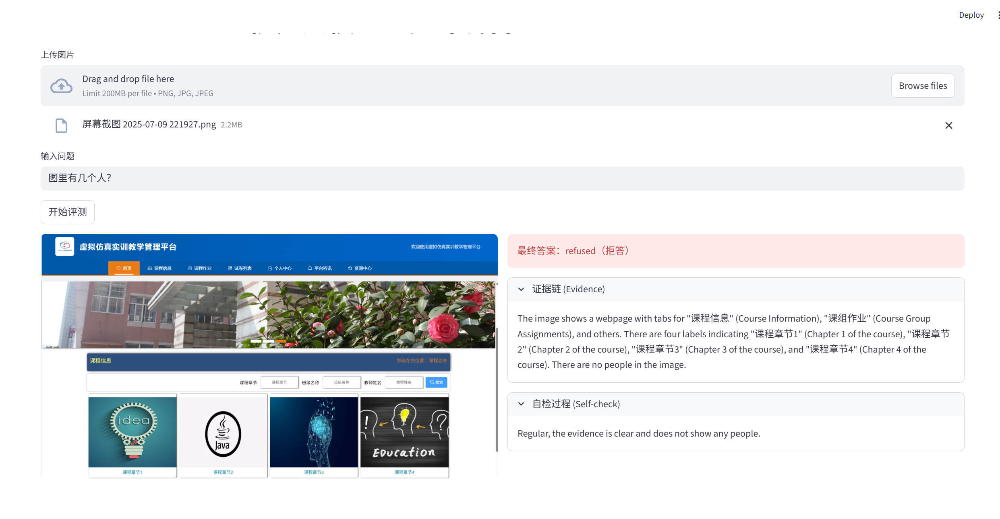
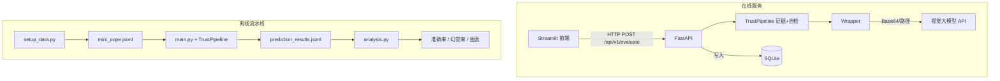

# MM-TrustBench：视觉大模型幻觉自动化评测与防范平台

> **一句话简介**：基于 POPE 数据集与「证据-自检」双重约束机制，量化并降低视觉大模型（VLM）幻觉率的评测工具与全栈交互式平台。

## 项目亮点 (Key Features)

本项目针对视觉大模型在诱导性提问下容易产生幻觉（无中生有）的问题，做了两件事：

1. **离线自动化评测流水线 (Offline Benchmark)**
   - 接入 COCO 与 POPE 标准数据，用脚本完成批量推理与阅卷。
   - 用「Evidence（证据链）+ Self-check（自检）」的 prompt 约束输出，能拦截一部分诱导性陷阱。
   - 自动算准确率、幻觉率、漏检率，并用 Matplotlib 出图。

2. **实时可视化评测台 (Online Interactive Service)**
   - 用 FastAPI 提供 RESTful 接口，Pydantic 约定入参出参。
   - 用 Streamlit 做前端：上传图片、输入问题，直接看模型的证据与自检结果。
   - 在线评测结果写入 SQLite（`data/trustbench.db`），便于追溯。

---

## 效果展示 (Demo)

### 1. 在线模式：成功拒答诱导提问
*当提问与画面不符或模型自检不通过时，会输出 `refused` 拒答，避免幻觉。*



### 2. 离线模式：阅卷与指标图
*跑完 `main.py` 再跑 `analysis.py` 后，将生成的图表复制到 `assets/` 即可在此展示。*


---

## 技术栈 (Tech Stack)

- **语言与模型**：Python 3.10，视觉模型走 OpenAI 兼容接口（如硅基流动 Qwen2.5-VL）
- **后端**：FastAPI、Uvicorn、Pydantic、SQLAlchemy
- **前端**：Streamlit、Requests
- **数据与存储**：SQLite（评测记录）、JSONL、Matplotlib

---

## 快速启动 (Quick Start)

### 1. 环境准备

```bash
git clone https://github.com/mining-wb/MM-TrustBench.git
cd MM-TrustBench

pip install -r requirements.txt
```

### 2. 配置环境变量

在项目根目录新建 `.env`，填入你的 API 配置（变量名与当前代码一致）：

```ini
API_KEY=your_api_key_here
API_URL=https://api.siliconflow.cn/v1/chat/completions
MODEL_NAME=Pro/Qwen/Qwen2.5-VL-7B-Instruct
```

### 3. 运行方式 A：可视化评测台 (Streamlit + FastAPI)

开两个终端：

```bash
# 终端 1：后端
uvicorn src.api:app --reload

# 终端 2：前端
streamlit run app.py
```

浏览器访问 `http://localhost:8501`。

### 4. 运行方式 B：自动化评测流水线 (Benchmark)

```bash
# 1. 准备数据（下载 POPE/COCO，生成 mini_pope.jsonl）
python setup_data.py

# 2. 批量评测（支持断点续传）
python src/main.py

# 3. 阅卷与指标、图表
python src/analysis.py
```

---

## 系统架构 (Architecture)



---

## 项目结构 (Project Structure)

```text
MM-TrustBench/
├── assets/                 # 项目截图、图表等对外展示用（随仓库推送）
├── app.py                  # Streamlit 前端入口
├── src/
│   ├── api.py              # FastAPI 路由
│   ├── schemas.py          # Pydantic 请求/响应模型
│   ├── database.py         # SQLite 引擎与会话
│   ├── models.py           # ORM 表（EvaluationRecord）
│   ├── trust_pipeline.py   # 证据链 + 自检流水线
│   ├── wrapper.py          # 模型 API 封装（支持路径与 Base64）
│   ├── main.py             # 批量评测脚本
│   └── analysis.py         # 阅卷、指标与画图
├── data/                   # 数据、结果与 trustbench.db（部分被 gitignore）
├── setup_data.py           # POPE/COCO 数据下载
├── requirements.txt
└── README.md
```

---

## 后续计划 (TODO)

- [ ] 支持更多视觉模型（如 GPT-4o、Claude 等）做横向对比
