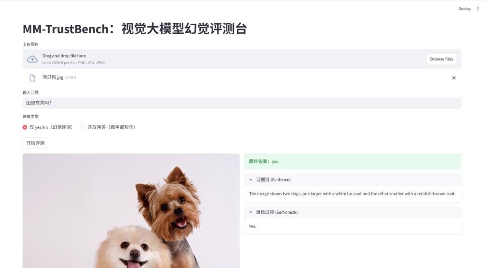
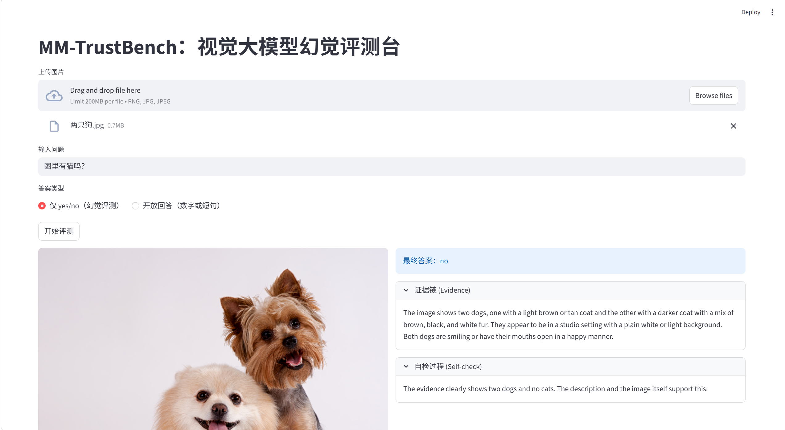
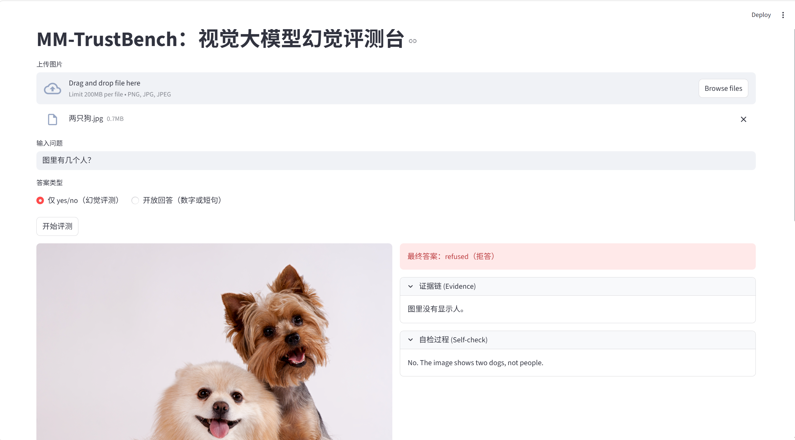
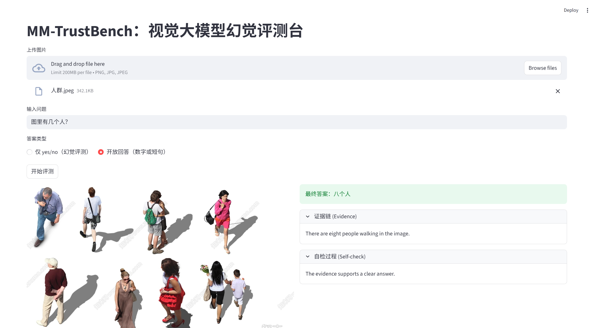
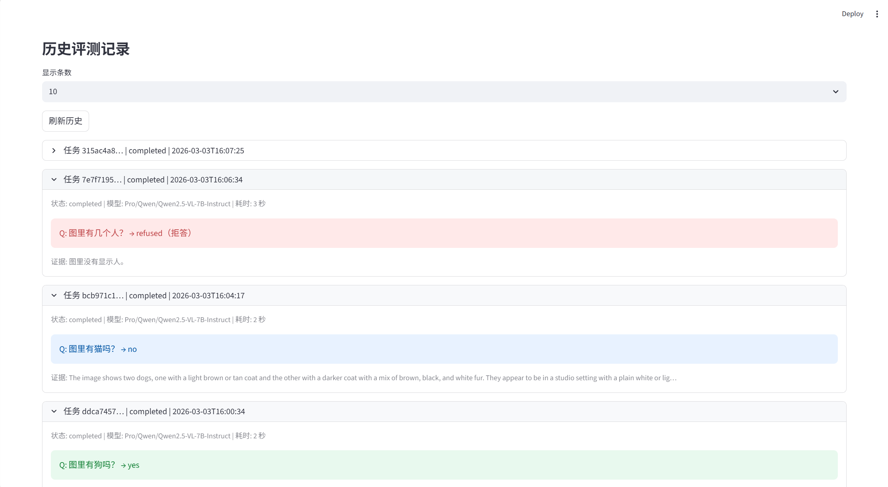
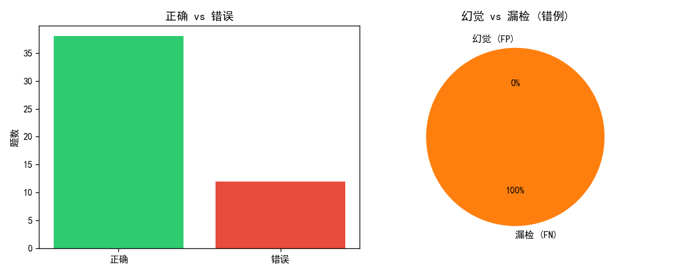
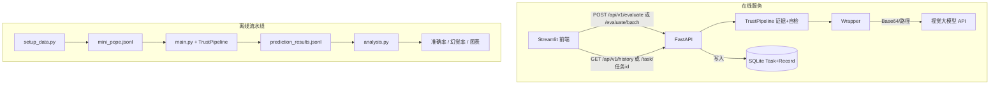

# MM-TrustBench：视觉大模型幻觉自动化评测与防范平台

> **一句话简介**：基于 POPE 数据集与「证据-自检」双重约束机制，量化并降低视觉大模型（VLM）幻觉率的评测工具与全栈交互式平台。

## 项目亮点 (Key Features)

本项目针对视觉大模型在诱导性提问下容易产生幻觉（无中生有）的问题，做了两件事：

1. **离线自动化评测流水线 (Offline Benchmark)**
   - 接入 COCO 与 POPE 标准数据，用脚本完成批量推理与阅卷。
   - 用「Evidence（证据链）+ Self-check（自检）」的 prompt 约束输出，能拦截一部分诱导性陷阱。
   - 自动算准确率、幻觉率、漏检率，并用 Matplotlib 出图。

2. **实时可视化评测台 (Online Interactive Service)**
   - 用 FastAPI 提供 RESTful 接口，Pydantic 约定入参出参。
   - 用 Streamlit 做前端：上传图片、输入问题，直接看模型的证据与自检结果。
   - **答案类型**：支持「仅 yes/no」幻觉评测与「开放回答」（数字或短句，如「图里有几个人？」→ 直接答人数）。
   - 在线评测结果写入 SQLite（`data/trustbench.db`），便于追溯。

---

## 效果展示 (Demo)

### 1. 在线模式（Streamlit 评测台）

在线评测支持四种典型结果：与图相符时答 **yes**、与图不符时答 **no**、诱导或不确定时 **拒答**、以及 **开放回答**（数字或短句）。下图依次展示。

| 场景 | 说明 |
|------|------|
| **答 yes** | 与画面相符的是非题（如「图里有猫吗？」且图中确有猫），模型返回「最终答案：yes」。 |
| **答 no** | 与画面不符的是非题（如「图里有狗吗？」但图中无狗），模型返回「最终答案：no」。 |
| **拒答** | 诱导性/模糊提问或自检不通过时，模型返回「最终答案：refused」避免幻觉。 |
| **开放回答** | 选择开放回答时，可问「图里有几个人？」等，模型直接返回数字或短句（如「9」）。 |

#### 1.1 答 yes（与图相符时肯定回答）



#### 1.2 答 no（与图不符时否定回答）



#### 1.3 拒答（诱导或不确定时拒答）



#### 1.4 开放回答（数字或短句）



#### 1.5 历史记录

页面下方可查看近期评测任务列表，按任务展开可看到每条的问题、最终答案与证据摘要。



### 2. 离线模式：阅卷与指标图

离线流水线对批量预测结果进行阅卷，并生成准确率、幻觉率等指标图表。下图为示例。



---

## 技术栈 (Tech Stack)

- **语言与模型**：Python 3.10，视觉模型走 OpenAI 兼容接口（如硅基流动 Qwen2.5-VL）
- **后端**：FastAPI、Uvicorn、Pydantic、SQLAlchemy
- **前端**：Streamlit、Requests
- **数据与存储**：SQLite（评测记录）、JSONL、Matplotlib

---

## 快速启动 (Quick Start)

### 1. 环境准备

```bash
git clone https://github.com/mining-wb/MM-TrustBench.git
cd MM-TrustBench

pip install -r requirements.txt
```

### 2. 配置环境变量

在项目根目录新建 `.env`，填入 API 配置（变量名与当前代码一致）。多模型时可在同文件追加第二组（`API_KEY_2`、`API_URL_2`、`MODEL_NAME_2`）等：

```ini
API_KEY=your_api_key_here
API_URL=https://api.siliconflow.cn/v1/chat/completions
MODEL_NAME=Pro/Qwen/Qwen2.5-VL-7B-Instruct
```

接口异常时统一返回 JSON：`{ "code": 状态码, "message": "说明", "data": null }`。

### 3. 运行方式 A：可视化评测台 (Streamlit + FastAPI)

开两个终端：

```bash
# 终端 1：后端
uvicorn src.api:app --reload

# 终端 2：前端
streamlit run app.py
```

浏览器访问 `http://localhost:8501`。接口文档与自测：启动后端后访问 `http://localhost:8000/docs`。

**主要接口**：`GET /api/v1/models` 可用模型列表（多模型时用）；`POST /api/v1/evaluate` 单条评测（同步，可选 `model_id`、`answer_type`）；`POST /api/v1/evaluate/batch` 批量评测（异步，返回 `task_id`，可选 `model_id`、`answer_type`）；`GET /api/v1/task/{task_id}` 轮询任务状态与结果；`GET /api/v1/history` 查询最近 N 条任务记录。**答案类型**：请求体可带 `answer_type`，`yes_no` 仅返回 yes/no/拒答（默认，用于幻觉评测）；`open` 可返回数字或短句（如数人数、简短描述）。多模型：`.env` 中配置 `API_KEY`/`API_URL`/`MODEL_NAME` 为默认，第二组用 `API_KEY_2`/`API_URL_2`/`MODEL_NAME_2`，请求里传 `model_id` 为 `default` 或 `2`。

### 4. 运行方式 B：自动化评测流水线 (Benchmark)

```bash
# 1. 准备数据（下载 POPE/COCO，生成 mini_pope.jsonl）
python setup_data.py

# 2. 批量评测（支持断点续传）
python src/main.py

# 3. 阅卷与指标、图表
python src/analysis.py
```

### 5. 运行测试

```bash
python -m pytest tests/ -v
```

---

## 系统架构 (Architecture)

- **在线服务**：Streamlit 通过 HTTP 调 FastAPI，不直连业务代码；FastAPI 内 TrustPipeline + Wrapper 调视觉模型；评测结果写入 SQLite（主表 EvaluationTask + 从表 EvaluationRecord）。
- **批量评测**：`POST /api/v1/evaluate/batch` 立即返回 `task_id`，后台执行评测；前端轮询 `GET /api/v1/task/{task_id}` 查进度与结果。


```mermaid
flowchart TB
  subgraph 在线服务
    A[Streamlit 前端] -->|POST /api/v1/evaluate 或 /evaluate/batch| B[FastAPI]
    B --> C[TrustPipeline 证据+自检]
    C --> D[Wrapper]
    D -->|Base64/路径| E[视觉大模型 API]
    B -->|写入| F[(SQLite Task+Record)]
    A -->|GET /api/v1/history 或 /task/任务id| B
  end
  subgraph 离线流水线
    G[setup_data.py] --> H[mini_pope.jsonl]
    H --> I[main.py + TrustPipeline]
    I --> J[prediction_results.jsonl]
    J --> K[analysis.py]
    K --> L[准确率 / 幻觉率 / 图表]
  end
```

---

## 项目结构 (Project Structure)

```text
MM-TrustBench/
├── assets/                 # 项目截图、图表等对外展示用（随仓库推送）
├── app.py                  # Streamlit 前端入口
├── src/
│   ├── api.py              # FastAPI 路由
│   ├── schemas.py          # Pydantic 请求/响应模型
│   ├── database.py         # SQLite 引擎与会话
│   ├── models.py           # ORM（EvaluationTask 主表 + EvaluationRecord 从表）
│   ├── trust_pipeline.py   # 证据链 + 自检流水线
│   ├── wrapper.py          # 模型 API 封装（支持路径与 Base64、多模型）
│   ├── main.py             # 批量评测脚本
│   └── analysis.py         # 阅卷、指标与画图
├── tests/                  # pytest 单元测试（analysis、api）
├── data/                   # 数据、结果与 trustbench.db（部分被 gitignore）
├── setup_data.py           # POPE/COCO 数据下载
├── requirements.txt
└── README.md
```

---